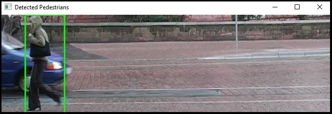

# Pedestrian Detection using HOG and SVM

This project implements a pedestrian detection system using Histogram of Oriented Gradients (HOG) for feature extraction and Support Vector Machine (SVM) for classification. The goal is to accurately detect pedestrians in images, leveraging machine learning techniques.

## Project Structure

```bash
pedestrian-detect-HOG-SVM
│
├── data/
│   ├── train/
│   │   ├── images/                                # Images for training
│   │   └── annotations/train-processed.idl        # Annotations with pedestrian coordinates
│   ├── test/
│   │   ├── images/                                # Images for testing
│   │   └── annotations/test-processed.idl         # Annotations with pedestrian coordinates
│
├── model/
│   │── svm_model.joblib                           # Trained SVM model (saved after training)
│   └── .gitkeep
│
├── src/
│   ├── annotations.py                             # Functions for reading annotation files
│   ├── config.py                                  # Configuration file with constants
│   ├── feature_extraction.py                      # Functions for feature extraction using HOG
│   ├── main.py                                    # Main entry point for the project
│   ├── metrics.py                                 # Functions for calculating metrics (TP, FP, FN) to evaluate object detection performance
│   ├── svm_training.py                            # Functions for training and predicting with the SVM model
│   └── utils.py                                   # Utility functions for generating random negative samples
│
├── .gitignore                                     # .gitignore
├── README.md                                      # README.md
├── requirements.txt                               # Lists Python packages required for the project
└── run.bat                                        # Batch script for automating project execution
```

## Installation

To set up this project, follow these steps:

1. **Clone the Repository:**

   ```bash
   git clone <repository-url>
   cd pedestrian-detect-HOG-SVM
   ```

2. **Unzip:**

   ```bash
   data/train/images/images.zip
   ```

   ```bash
   data/test/images/images.zip
   ```

The result should be the following structure

```bash
data/train/images/1.png
...
data/train/images/250.png
```

```bash
data/train/images/5.png
...
data/train/images/244.png
```

3. **Install Dependencies:**
   Make sure you have Python installed, then run:
   ```bash
   pip install -r requirements.txt
   ```

Or

3. **You can run the project using the run.bat:**

   ```bash
   run.bat
   ```

## Usage

You can run the project using the `run.bat` script or by executing the `main.py` script directly with command-line arguments.

### Main Menu Options

When you run the project, you'll see a menu with the following options:

1. **Train the Classifier**: This option allows you to train the SVM classifier using annotated training images.
2. **Test the Classifier**: Evaluate the classifier's performance on test images with annotations and display precision and recall metrics.
3. **Classify a New Image**: Detect pedestrians in a new image by providing its path.
4. **Exit**: Exit the application.

### Running the Project

To start the application, execute:

```bash
python src/main.py
```

or

```bash
run.bat
```

## Features Implemented

1. **HOG Feature Extraction:**

   - For each image in the training dataset, patches of size 200x80 pixels were extracted corresponding to pedestrian coordinates from annotation files (Figure 2).
   - A function was implemented to compute Histogram of Oriented Gradients (HOG) for each image patch (Figure 3).
   - HOG descriptors were obtained and saved as feature vectors for further classifier training (Figure 4).

2. **Training of a Linear SVM:**

   - The scikit-learn library was used to train a linear SVM based on the extracted features (Figure 5).
   - The model was trained on the prepared patches using class vectors (1 – pedestrian, 0 – background) (Figure 6).
   - Cross-validation was performed to select the optimal SVM parameters and avoid overfitting (Figure 7).
   - The trained classifier was saved to a file (Figure 8).

3. **Pedestrian Detector Implementation:**

   - A sliding window algorithm was implemented, which moves the window across the image to search for potential pedestrians (Figure 9).
   - HOG descriptors were computed for each image patch, and the trained SVM was used for classification (Figure 9).

4. **Classification Evaluation:**

   - Precision and recall metrics were calculated to assess classification performance (Figure 10).
   - It was confirmed that pedestrian detection accuracy exceeds 50% based on intersection-over-union with ground truth coordinates (Figure 11).
   - The classification result was evaluated, with precision no less than 70% and recall no less than 70% (Figure 12).

5. **Console User Interface:**
   - Options to train the classifier.
   - Options to test the classifier.
   - Classify new images and display results with green bounding boxes around detected pedestrians (Figure 14).
   - Option to exit the program.

## Example of Detected Pedestrians

Here is an example of the detected pedestrians in an image:


